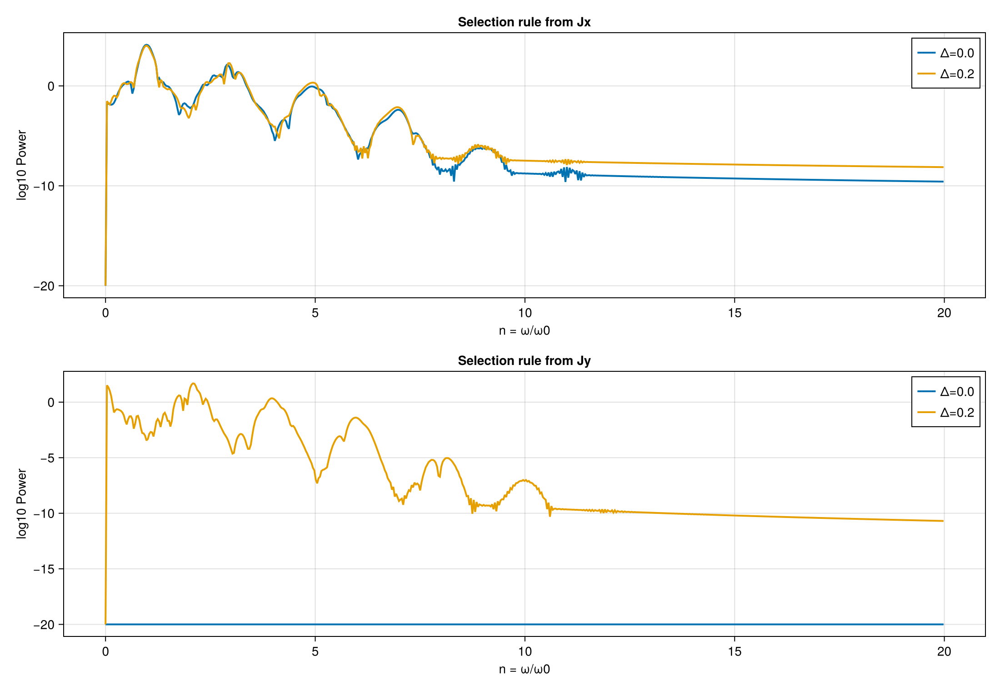

# 周辺話題いくつか

## PkgTemplates.jl: 雛形は入口をそろえる

::: {.columns}
::: {.column width="50%"}
### 先にそろえておきたい器

- `Project.toml` と package 名
- `src/` と公開入口
- `test/` と `runtests.jl`
- `README` と CI の土台

手で始めると後回しになりやすい入口を、最初にまとめて固定する。
:::

::: {.column width="50%"}
::: {.fact-card}
### PkgTemplates の役割

- 最低限の構成を最初に固定する
- `src/`, `test/`, `README`, CI の迷いを減らす
- 実装そのものの代わりではない
:::
::: {.fact-card}
### 雛形だけでは足りない

- 中身の妥当性は自分で検証する
- 物理の説明や例題の読み方は別に要る
- 雛形は入口であり、研究コードそのものではない
:::
:::
:::

## 可視化依存は `ext` に分ける

::: {.columns}
::: {.column width="54%"}
### 将来 package 化すると起こること

- `plot_hhg` のような標準可視化関数を足したくなる
- ただし `Makie` や `Plots` を本体 `[deps]` に入れると、計算だけ使いたい人にも重い依存が乗る
- 本体では関数名だけ公開し、描画実装は `ext/` に逃がす
- そうすると backend を後から増やしやすく、コア計算も軽く保ちやすい

:::

::: {.column width="46%"}
```toml
[weakdeps]
CairoMakie = "..."

[extensions]
GrapheneHHGCairoMakieExt = "CairoMakie"
```

```julia
# src/GrapheneHHG.jl
function plot_hhg end

# ext/GrapheneHHGPlotExt.jl
GrapheneHHG.plot_hhg(spec) = ...
```

:::
:::

## ドキュメント 1: README

::: {.columns}
::: {.column width="50%"}
### README で最初に知りたいこと

- これは何を計算する repo か
- どう環境構築し、どう実行するか
- 何が出力され、どの図が再現できるか

:::

::: {.column width="50%"}

::: {.code-map}
### README が入口になる理由

- 受講者はまず「何を打てば動くか」を見る
- 査読者はまず「第三者が再現できるか」を見る
- 将来の自分も、最初に README を読む
:::
:::
:::

## ドキュメント 2: 詳細 docs

::: {.columns}
::: {.column width="52%"}
### 役割の分け方

::: {.mini-table .smaller}
| 置く場所 | 主な役割 |
| --- | --- |
| `README` | 導入、インストール、最短の実行手順 |
| 詳細 docs | 背景、API、図の読み方、設計の理由 |
| `examples/` | 実際に再現する最短経路 |
:::

### 分ける利点

- README を短く保てる
- 背景説明を削らずに置ける
- API の説明を source と同期しやすい
:::

::: {.column width="48%"}
::: {.fact-card}
### この repo で対応する場所

- `README.md`: セットアップ、checkpoint、examples の入口
- `docs/src/index.md`: API 一覧と `@docs` / `@autodocs`
- `docs/make.jl`: HTML 生成と公開設定
- `examples/02_timeevol_current.jl`: `simulate_currents` の利用例
:::

::: {.code-map}
### 読む順番

- README で「何を動かすか」をつかむ
- docs で関数や型の意味を確認する
- `examples/` で図を再現する
:::
:::
:::

## ドキュメント 3: docstring から API docs へ

::: {.columns}
::: {.column width="57%"}
```julia
"""
授業で使う既定のガウシアンパルスを作る。
# キーワード引数
- `A0`, `ω0`, `t0`, `fwhm_cycles`
# 戻り値
- `PulseParams`
"""
function default_pulse(; A0=0.5, ω0=0.7, t0=0.0, fwhm_cycles=5.0)
    ...
end
```

````markdown
## 講義で使う主要 API
```@docs
PulseParams
default_pulse
A
```
````
:::

::: {.column width="43%"}
### この repo での使い方

- `src/pulse.jl` の説明を `""" ... """` にする
- `docs/src/index.md` の `@docs` に並べる
- `?default_pulse` や HTML docs から同じ説明を読める

::: {.fact-card}
### docstring に入れるもの

- 役割
- 主要引数
- 戻り値
- 必要なら補足
:::
:::
:::

## ドキュメント 4: Documenter.jl + GitHub Pages

::: {.columns}
::: {.column width="58%"}
```julia
# docs/make.jl
makedocs(;
    modules=[GrapheneHHG],
    pages=["Home" => "index.md"],
)

deploydocs(; repo="github.com/xxxxxxxx/GrapheneHHG.jl", devbranch="main")
```

```yaml
# .github/workflows/ci.yml
- uses: julia-actions/julia-docdeploy@v1
  env:
    GITHUB_TOKEN: ${{ secrets.GITHUB_TOKEN }}
    DOCUMENTER_KEY: ${{ secrets.DOCUMENTER_KEY }}
```
:::

::: {.column width="42%"}
::: {.step-grid}
::: {.step-card}
<div class="num">1</div>
<p><code>docs/src/</code> を読む</p>
:::
::: {.step-card}
<div class="num">2</div>
<p><code>makedocs</code> で HTML 化する</p>
:::
::: {.step-card}
<div class="num">3</div>
<p>CI の docs job が deploy を担当する</p>
:::
::: {.step-card}
<div class="num">4</div>
<p>GitHub Pages で公開する</p>
:::
:::

### この repo で見る場所

- `docs/make.jl` が module とページ構成を決める
- `.github/workflows/ci.yml` が build と公開の入口になる
- docstring を増やすほど `@docs` の中身も増やせる
:::
:::

## CIテスト: 手元の確認を自動化する

::: {.columns}
::: {.column width="54%"}
```yaml
name: CI
on:
  push:
    branches:
      - main
    tags: ["*"]
  pull_request:
  workflow_dispatch:
jobs:
  test:
    ...
    steps:
      - uses: actions/checkout@v6
      - uses: julia-actions/setup-julia@v2
      - uses: julia-actions/cache@v3
      - uses: julia-actions/julia-buildpkg@v1
      - uses: julia-actions/julia-runtest@v1
```
:::


### CI に写す理由

- ビルドが通ることを保証できる
- 壊れていれば早く気がつく

:::
:::

## カバレッジ 1: 数字より未検証箇所の発見

::: {.columns}
::: {.column width="50%"}
::: {.step-grid}
::: {.step-card}
<div class="num">1</div>
<p>テストを実行する</p>
:::
::: {.step-card}
<div class="num">2</div>
<p>通った行と通っていない行を記録する</p>
:::
::: {.step-card}
<div class="num">3</div>
<p>未確認の分岐や異常系を見つける</p>
:::
::: {.step-card}
<div class="num">4</div>
<p>必要なテストを追加する</p>
:::
:::
:::

::: {.column width="50%"}
### coverage で分かること

- どの分岐がまだ通っていないか
- 異常系や端の条件を見落としていないか
- `examples` と `tests` の間に穴がないか

### coverage で分からないこと

- 物理的な妥当性そのもの
- 比較条件が適切かどうか
- 図の解釈が正しいかどうか

<span class="center-stat">高スコア = 十分 ではない</span>
:::
:::

## カバレッジ 2: どこから増やすか

::: {.columns}
::: {.column width="52%"}
### この repo で優先したい箇所

- `hhg_spectrum` の異常入力
- `current_traces` の長さ不一致
- `ci/verify_repo.jl` の starter / solution 分岐
- TODO から完成版へ変わる箇所
- `examples` でしか触らない経路

### 増やし方の原則

- 行数を埋めるためのテストは書かない
- 壊れたとき困る経路から埋める
- 物理的に意味のある境界条件を優先する
:::

::: {.column width="48%"}
::: {.code-map}
### 将来の運用例

- coverage レポートを CI で生成する
- Codecov のような可視化サービスへ送る
- PR ごとに「どこが未確認か」を見る
:::

### ただし

- ここで大事なのは数値より運用の意味
- 現状この repo に coverage 連携は入っていない
- まずは「何をまだ試していないか」を言えるようにする
:::
:::

## 論文投稿 1: JOSS が見る研究ソフトの観点

::: {.columns}
::: {.column width="54%"}
::: {.fact-grid .tiny}
::: {.fact-card}
### README

- 何のソフトか
- どう導入し、どう実行するか
:::
::: {.fact-card}
### docs / examples

- どんな入力で何が出るか
- 代表的な使い方を追えるか
:::
::: {.fact-card}
### tests / CI

- 第三者が壊れていないと確認できるか
- 継続的に検証されているか
:::
::: {.fact-card}
### software としての価値

- 論文本文の補助ではなく
- 再利用可能な道具として見てもらえるか
:::
:::
:::

::: {.column width="46%"}
### JOSS 的な見方

- 研究結果だけでなく software 自体がレビュー対象
- 他人が install して main example を追えることが重要
- 説明、検証、実行例がそろって初めて再利用しやすい

### この講義との接続

- README を書く
- テストと CI をそろえる
- docs の層を分ける
- その積み重ねが投稿準備になる
:::
:::

## 論文投稿 2: 授業 repo から投稿準備へ

::: {.columns}
::: {.column width="58%"}

:::
:::

::: {.column width="42%"}
::: {.code-map}
### 授業後に足すもの

- README を利用者向けに磨く
- 詳細 docs を追加する
- tests / CI を継続運用する
- coverage の抜けを埋める
- release と投稿用の説明文を整える
:::

### ここでの結論

- 再現できるだけではまだ半分
- 他人が読めて、試せて、直せる形にして初めて共有できる
:::
:::

## まとめ

::: {.columns}
::: {.column width="50%"}
### できるようになったこと

- `Jx(t), Jy(t)` を FFT して HHG スペクトルへ変換できる
- 動的対称性と選択則からスペクトル形状を説明できる

::: {style="margin-top: -10px;"}
{fig-alt="selection comparison from example" fig-align="center" width=80%}
:::
:::

::: {.column width="50%"}
### 実装と物理の接続

- `hhg_spectrum` が何をしているか読める
- `current_traces` が何を集計しているか説明できる
- 図から読めることと、理論的な説明を分けて話せる
- `README` / docs / CI / テストが、再現結果の共有を支えると分かる
:::
:::

# Appendix

## Additional remark

- 汎用コード化に向けて。各パラメータはハードコードしない。
- `ArgParse.jl`を使うと便利。

## パラメータ比較の原則

::: {.columns}
::: {.column width="50%"}
### 物理パラメータ

- `γ`: コヒーレンスの減衰を強める
- `A0`: 非線形性を強める
- `ω0`: 横軸 `n = ω/ω0` の基準を決める
:::

::: {.column width="50%"}
### 数値条件

- `dt` を変えると周波数軸が変わる
- 入力長を変えると分解能が変わる
- 比較では、同時に変える量を 1 個へ絞る
:::
:::
