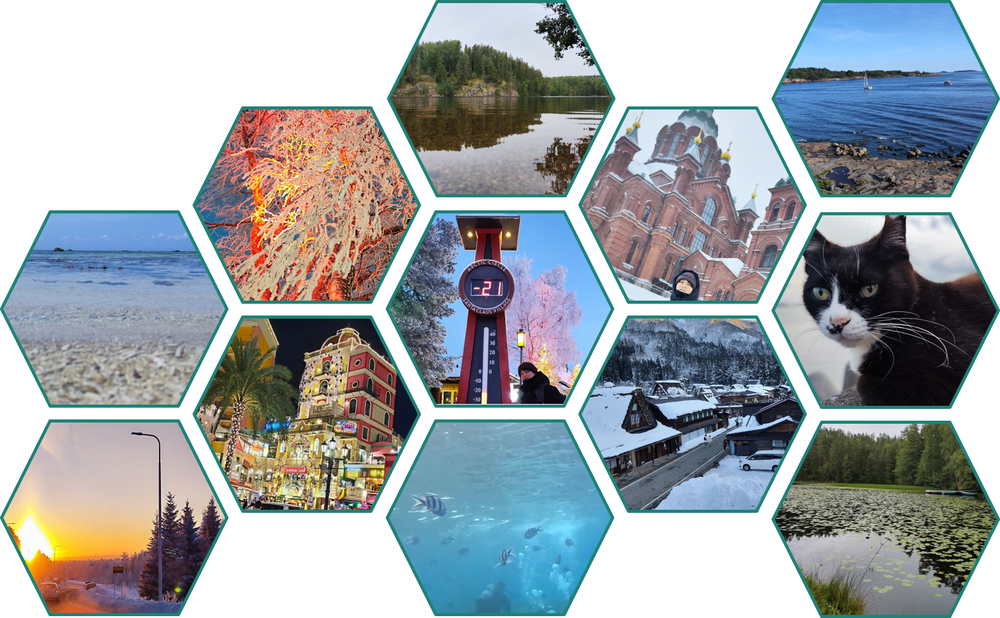
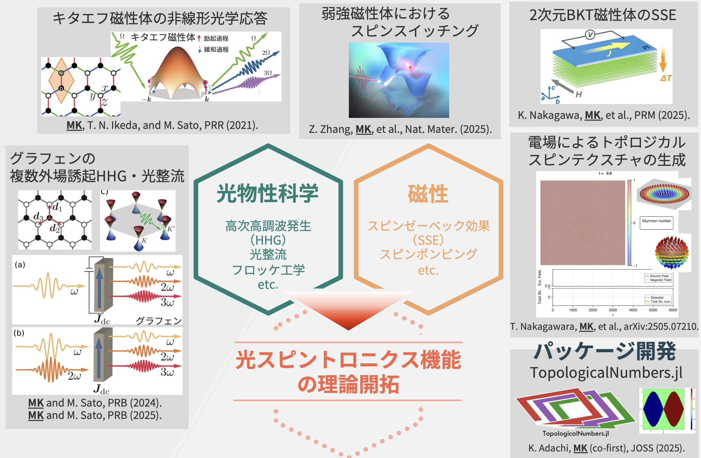
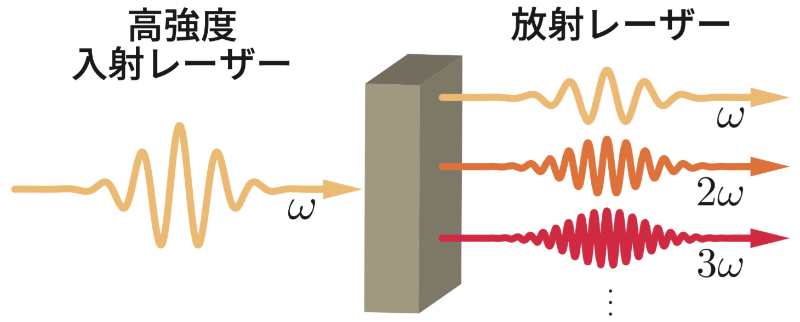
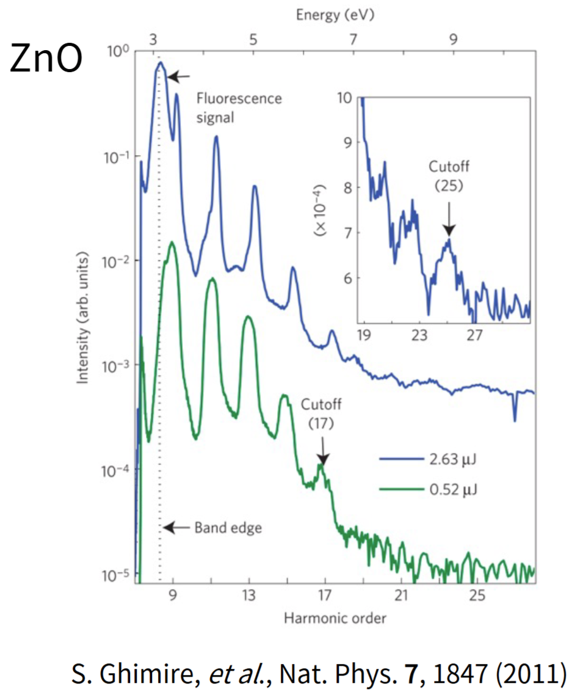
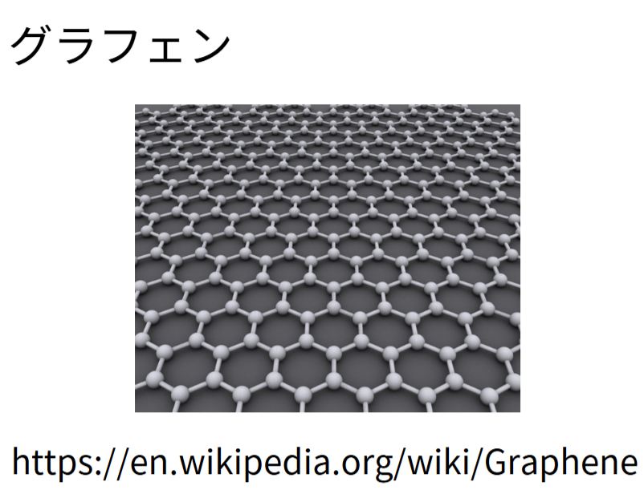
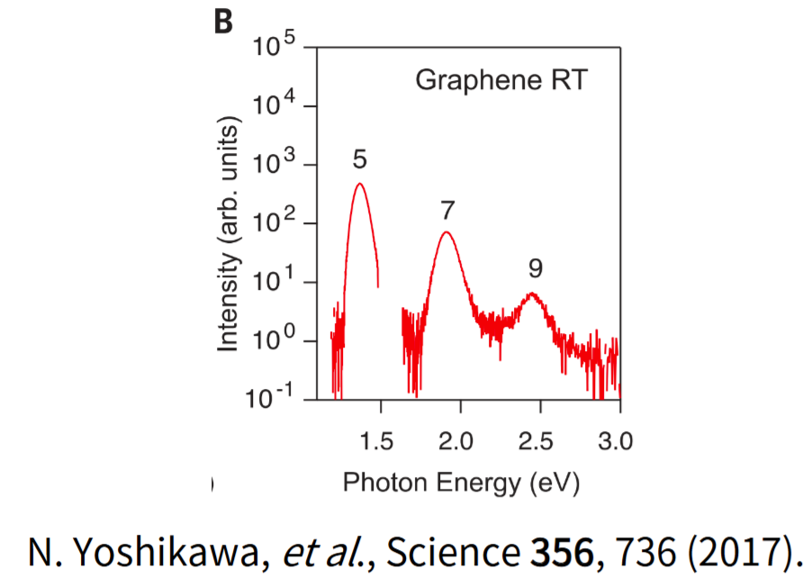

## 自己紹介

::: {.columns}
::: {.column width="50%"}
### 担当

- 金賀 穂
- 千葉大学 大学院理学研究院
- 後半 2 コマを担当

### 研究キーワード

- 物性理論
- 光物性
- 磁性・スピントロニクス
- 非平衡ダイナミクス
:::

::: {.column width="50%"}
{width=100%}
:::
:::

## 研究紹介
::: {style="margin-top: -10px;"}
{fig-align="center" width=70%}
:::

## 進め方

::: {.columns}
::: {.column width="45%"}
### 今日の立ち位置

- 前半で扱った Julia / コーディングエージェントを、さらに実践的な研究コードの読解と穴埋めへ接続する
- 数式をそのまま Julia 実装へ落とし、結果を見て物理解釈する

### 今日の到達点

- 前半で `01_bands.png`と `02_timeevol_current.png` を再現する
- 後半で `03_hhg_fft.png`と `04_selection_rule.png` を再現する

:::

::: {.column width="55%"}

### 事前準備

- 配布リポジトリを clone して作業ディレクトリへ入る
- 依存関係は最初に一度だけ入れる

```bash
julia --project=. -e 'using Pkg; Pkg.instantiate()'
```

### checkpoint の使い方

- 例えばハンズオン1 で詰まったら `checkpoint-1-band`

```bash
git switch --detach checkpoint-1-band
```

:::
:::

## 第1コマの流れ

::: {.step-grid}
::: {.step-card}
<div class="num">0</div>
<p>セットアップ確認、checkpoint の使い方、AI の使い方</p>
:::
::: {.step-card}
<div class="num">1</div>
<p>高次高調波発生やGKSL方程式等の基本概念の導入</p>
:::
::: {.step-card}
<div class="num">2</div>
<p>ハンズオン1: バンド図を作る</p>
:::
::: {.step-card}
<div class="num">3</div>
<p>ハンズオン2: 電流を計算して時間発展をプロットする</p>
:::
:::

## 高次高調波発生（HHG）

::: {.columns}
::: {.column width="45%"}
HHG → 最も単純な非線形光学効果の一つ

{fig-alt="HHG time evolution" fig-align="center" width=70%}

:::

::: {.column width="55%"}
### 最初に持ってほしいイメージ

- 高強度レーザーを入れると、固体電子系が非線形に応答する
- その応答は電流や分極の時間変化として現れる
- 高調波は、周波数空間へ写した結果として観測される

:::
:::

::: {.columns}
::: {.column width="40%"}
::: {style="margin-top: -70px;"}
{fig-alt="HHG time evolution" fig-align="center" width=55%}
:::

:::

::: {.column width="30%"}
{fig-alt="HHG time evolution" fig-align="center" width=88%}
:::

::: {.column width="30%"}
{fig-alt="HHG time evolution" fig-align="center" width=88%}
:::
:::

**HHGの数値解析を実践してみましょう！**
