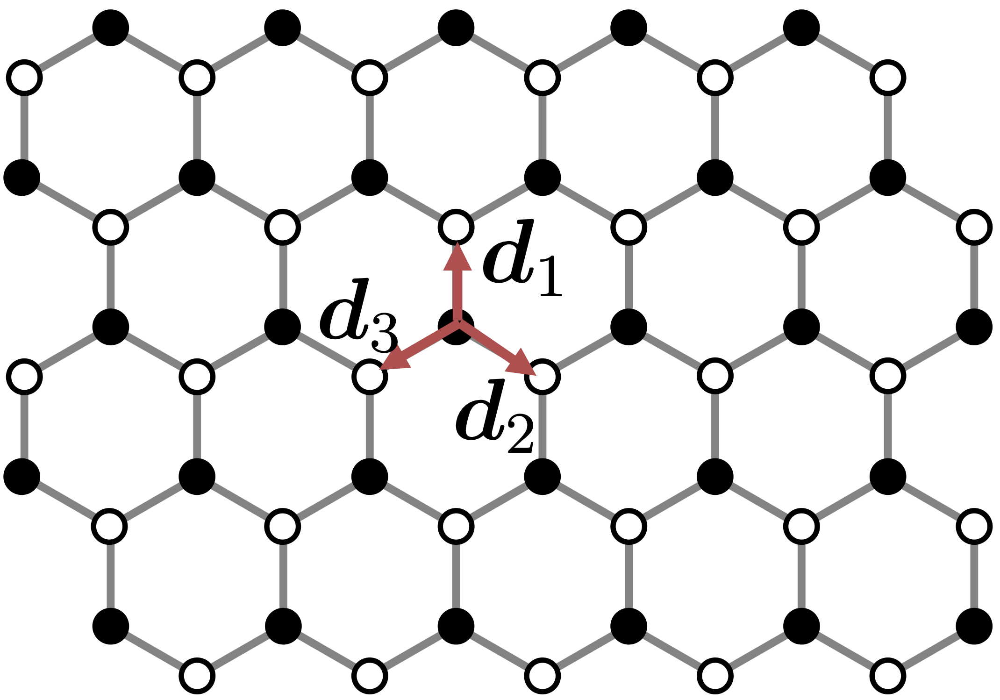
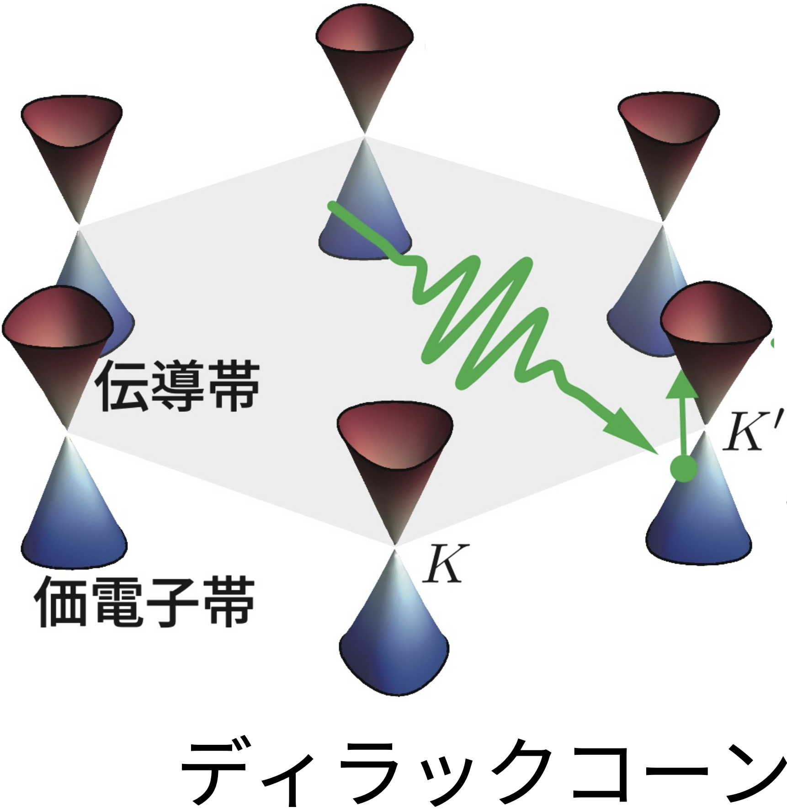
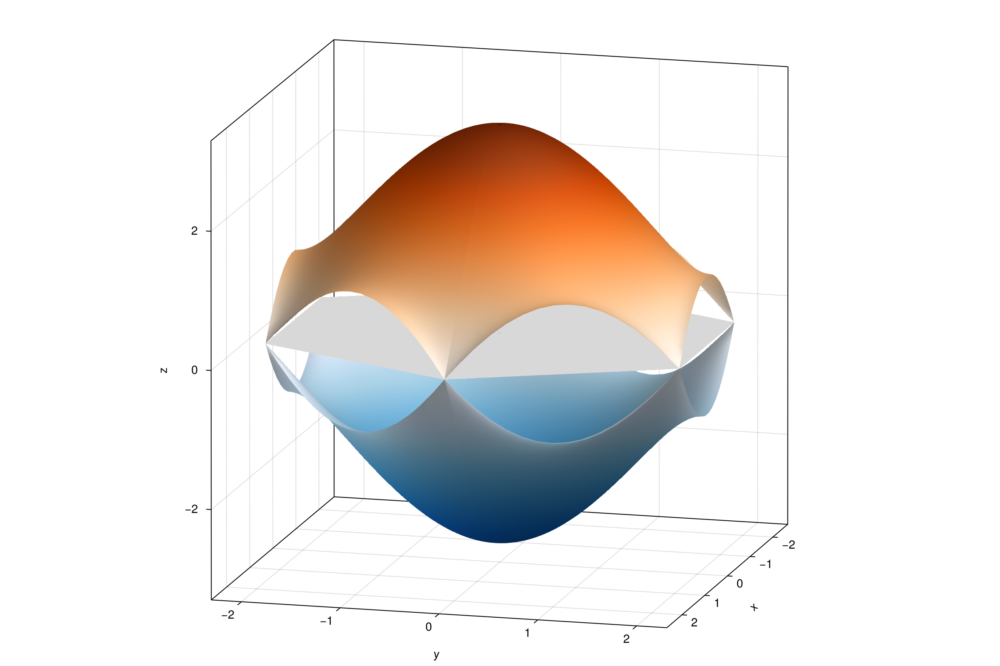

## グラフェン

::: {.columns}
::: {.column width="50%"}
{fig-alt="graphene lattice" fig-align="center" width=50%}

:::

::: {.column width="50%"}
### 実空間で持つ自由度

- 黒丸と白丸が A/B 副格子

### 電子の生成消滅演算子

- $\hat a_{\bm r}$ / $\hat b_{\bm r}$  
  → A/B 副格子の電子の消滅演算子

:::
:::

### タイトバインディング模型

$$
\hat H_0 = -t_0 \sum_{\bm r}\sum_{j=1}^3 (\hat b_{\bm r+\bm d_j}^\dagger \hat a_{\bm r} + \text{h.c.})
+ \Delta\sum_{\bm r} (\hat a_{\bm r}^\dagger \hat a_{\bm r} - \hat b_{\bm r}^\dagger \hat b_{\bm r})
$$

:::aside
- $t_0$: 最近接ホッピングの強さ
- $\Delta$: スタガードポテンシャルの強さ
:::

## 逆格子と Dirac cone

::: {.columns}
::: {.column width="40%"}
{fig-alt="graphene BZ and gap" fig-align="center" width=60%}

:::

::: {.column width="60%"}
### 波数空間で何をするか

- 計算は逆格子原胞（ひし形）で進める
- 図では 六角形 BZ に切り出して表示する

### `Δ` の役割

- `Δ = 0` では Dirac cone が閉じる（ギャップレス）
- `Δ ≠ 0` では gap が開く
:::
:::


$$
{\small
\hat a_\br = \frac{1}{\sqrt{N}}\sum_{\bk}\tilde a_\bk e^{-i\bk\cdot\br}, \quad \hat b_\br = \frac{1}{\sqrt{N}}\sum_{\bk}\tilde b_\bk e^{-i\bk\cdot\br}
}
$$


$$
\hat{H}_0=\sum_\bk\bm{C}^\dag_\bk \mathcal H(\bk)\bm{C}_\bk, \quad \bm{C}_\bk=\mqty(\tilde{a}_\bk & \tilde{b}_\bk)^\top
$$


## 価電子帯と伝導帯

::: {.columns}
::: {.column width="52%"}

$$
\mathcal H(\bm{k})=
\begin{pmatrix}
\Delta & -t f(\bm{k})\\
-t f^*(\bm{k}) & -\Delta
\end{pmatrix}
$$

$$
{\small
f(\bm{k})=\sum_{j=1}^3 e^{i\bm{k}\cdot\bm{d}_j}
}
$$

### 対角化
$$
E_\pm(\bm{k})=\pm\sqrt{\Delta^2+t^2|f(\bm{k})|^2}
$$
$$
\mqty(\xi_\bk & \zeta_\bk)=U^\dag_\bk\bm{C}_\bk
$$

\begin{align*}
\ket{v_\bk} =\zeta^\dag_\bk\ket{0_\bk}\\
\ket{c_\bk} =\xi^\dag_\bk\ket{0_\bk}
\end{align*}

:::

::: {.column width="48%"}
### 読み方

- `±Δ` が A/B 副格子の非対称性
- `-t f(k)` が最近接ホッピングの総和

### このあと重要

- `H(k)` が分かれば `dH/dk` も解析的に書ける
- その `dH/dk` が、あとで `current_traces` へ入る
:::
:::


## ハンズオン1: バンド構造を描く

::: {.columns}
::: {.column width="42%"}
### 対象

- `src/tb.jl`
- `examples/01_bands.jl`

### 到達目標

- `f(k)`, `dfdk`, `H(k)`, `dHdk` を埋める
- `examples/out/01_bands.png` を出す
- 余裕があれば `test/test_tb.jl` に TB テストを 2 本書く

:::

::: {.column width="58%"}
{fig-alt="六角形BZ上のバンド図" width=80%}

::: {.source-caption}
図: `examples/01_bands.jl`
:::

### 詰まったら

- `checkpoint-1-band`
:::
:::

## ハンズオン1 詳細: `f(k)` と `H(k)` の穴埋め

::: {.columns}
::: {.column width="54%"}
$$
f(\bm{k})=\sum_{j=1}^3 e^{i\bm{k}\cdot\bm{d}_j}
$$

$$
\mathcal H(\bm{k})=
\begin{pmatrix}
\Delta & -t f(\bm{k})\\
-t f^*(\bm{k}) & -\Delta
\end{pmatrix}
$$

```julia
function f(k, dvecs = NN_VECTORS)::ComplexF64
    # ここを実装
end

function H(k, p::TBParams)::CMat2S
    # ここを実装
end
```
:::

::: {.column width="46%"}

### 手元のコードでの見方

- 空欄の前後にある型注釈と `TBParams` を先に読む
- 数式を Julia へ写す
:::
:::

## ハンズオン1 詳細: `dfdk`, `dHdk`

::: {.columns}
::: {.column width="54%"}
$$
\frac{\partial f}{\partial k_\alpha}
=
i\sum_j d_{j,\alpha} e^{i\bm{k}\cdot\bm{d}_j}
$$
$$
\pdv{\mathcal H}{k_\alpha}=
\begin{pmatrix}
0 & -t \pdv{f}{k_\alpha}\\
-t \pdv{f^*}{k_\alpha} & 0
\end{pmatrix}
$$

```julia
function dfdk(k, dvecs::NTuple{3,Vec2}=NN_VECTORS)::SVector{2,ComplexF64}
    # ここを実装
end
function dHdk(k, p::TBParams)::Tuple{CMat2S,CMat2S}
    # ここを実装
end
```
:::

::: {.column width="46%"}
### 最初から埋まっている周辺コード

- `NN_VECTORS`, `b1`, `b2`: 格子定義
- `hex_vertices(b1, b2)`: 六角形 BZ の頂点
- `hex_surface_coordinates(...)`: 表示用の座標生成
- `band_surfaces(kx, ky, tb)`: 各点で固有値を取って上下バンドを作る

### 実装時の注意

- `dfdk[1]` が x, `dfdk[2]` が y
- `dHdk` は電流用に使う
:::
:::

## ハンズオン1 追加: ユニットテストを書く

::: {.columns}
::: {.column width="56%"}
### バンド図が出た人向け

- `examples/01_bands.jl` で図が出たら取り組む
- checkpoint 到達条件ではなく、早い人向けの追加ミニ課題
- `test/test_tb.jl` に 3 本書けばよい

```bash
julia --project=. -e 'using GrapheneHHG; include("test/test_tb.jl")'
```
:::

::: {.column width="44%"}
### 進め方

- バンド図完成
- `test/test_tb.jl` を読む
- ユニットテストを 3 本書く
- 個別実行で確認する

### ここでの位置づけ

- この段階ではハミルトニアンだけを確かめる
- repo 全体の `Pkg.test()` はハンズオン2で初めて回す
:::
:::

## ハンズオン1 詳細: `test/test_tb.jl` で見ること

### 1 本目: エルミート性

- `H(k)` がエルミート性を保っているか

### 2 本目: `±E` 対称

- グラフェン 2 バンド模型の基本的なバンド対称性を守れているか
- 数式をコードへ写した結果が、固有値にも反映されているかを見る

### 3 本目: $\bm K=\frac{2\pi}{3\sqrt 3}(1,\sqrt 3)$ でギャップレス

- $\Delta=0$のとき、$\bm K$点でギャップレスとなる


## AI活用 Prompt: ハンズオン1 の穴埋め前確認

::: {.prompt-card}
<div class="eyebrow">GitHub Copilot Agent</div>
利用文脈: 手元の `src/tb.jl` を埋める前に、式とコードの対応を確認する。

```text
手元の src/tb.jl で、f(k), dfdk(k), H(k, p), dHdk(k, p) の空欄を埋めたいです。
現行の引数・戻り値・型注釈に合わせて、
1. 数式と各関数の対応
2. Julia の候補コード
3. 対応するテスト観点を 3 つ
4. 確認項目
の順で整理してください。
特に、複素共役、x/y 成分順、エルミート性、`Δ = 0` での固有値対称性の確認を明示してください。
```

大事なのは、**AIの実装の物理骨格をちゃんと理解し、自分のものとする**こと。（≠1行1行をチェックする）  
**数式との対応を意識して、コードの意味をちゃんと理解することが重要**です。  
また、その**関数が満たすべき物理的制約をきちんと満たしているか確認するユニットテストを追加**しましょう。

:::

## FB1: バンド図から何を読むか

::: {.columns}
::: {.column width="55%"}
{fig-alt="六角形BZ上のバンド図" width=92%}

::: {.source-caption}
図: `examples/01_bands.jl`
:::
:::

::: {.column width="45%"}
### まず確認すること

- 六角形 BZ の角が $\bm K$/$\bm K'$ 点[^1]に対応しているか
- `Δ = 0` なら$\bm K$/$\bm K'$点付近で cone が閉じているか
- `Δ ≠ 0` に変えたとき gap が開くか

### この段階で掴めればよいこと

- `H(k)` の形がバンド図へどう写るか
:::
:::

[^1]: $\bm K=\frac{2\pi}{3\sqrt 3}(1,\sqrt 3),\quad\bm{K}' = \frac{2\pi}{3\sqrt 3 a}(-1,\sqrt 3)$
