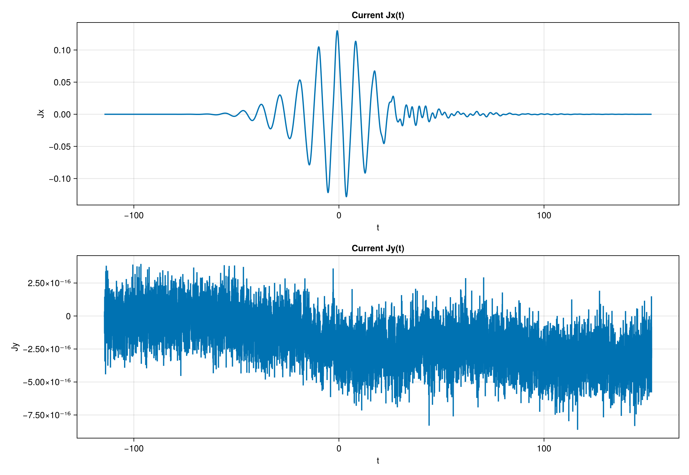

## 次に追加: 静的なバンド図から `J(t)` へ

::: {.columns}
::: {.column width="48%"}
### ここまで

- `H(k)` と `dH/dk` が書けた
- 六角形 BZ 上でバンド構造を描けた
:::

::: {.column width="52%"}
### 次に足すもの

- `A(t)` による時間依存
- `L_k` による緩和
- `ρ_k(t)` の時間発展
- `current_traces` による `Jx(t), Jy(t)` の観測
:::
:::

## パイエルス置換

::: {.columns}
::: {.column width="52%"}
### レーザーの効果をどう入れるか？
→ パイエルス置換
$$
t_0 \rightarrow t_{\br,\br+\bm d_j}(t) = t_0\exp\left(-ie\int_\br^{\br+\bm d_j} \bm{A}(t)\cdot d\br\right)
$$

\begin{align}
    \hat{H}(t)= & -\sum_{\bm{r},j}(t_{\br,{\br+\bm d_j}}(t)\hat b_{\br+\bm d_j}^\dag\hat a_\br + t_{{\br+\bm d_j},\br}(t)\hat a_\br^\dag\hat b_{\br+\bm d_j})
                 + \Delta\sum_\br(\hat a^\dag_\br\hat a_\br - \hat b^\dag_{\br+\bm d_1}\hat b_{\br+\bm d_1}) \\
                =&\sum_\bk\bm{C}^\dag_\bk \mathcal H(\bk+e\bm{A}(t))\bm{C}_\bk \\
    \mathcal H_\bk(t) &:= \mathcal H(\bk+e\bm{A}(t))
\end{align}


:::

::: {.column width="48%"}
$$
\bm{k}\rightarrow \bm{k}+\bm{A}(t),
\qquad
\bm{E}(t)=-\partial_t\bm{A}(t)
$$

```julia
pulse = default_pulse(; A0 = 0.5, ω0 = 0.7, fwhm_cycles = 5.0)
At = A(t, pulse)
```

:::
:::

本講義では$x$軸方向直線偏光として実装してある。

## 量子マスター（GKSL）方程式

$$
\dot{\rho}_\bk(t)=
-i[\mathcal H_\bk(t), \rho_\bk(t)]
+\gamma\left(
L_\bk \rho_\bk L_\bk^\dagger
-\frac{1}{2}\{L_\bk^\dagger L_\bk,\rho_\bk\}
\right)
$$

### なぜGKSL型のマスター方程式を使うのか？

- 自然に緩和を取り込める
- マルコフ性／正値性・トレース保存により確率解釈が可能

### このモデルで入れるもの

- 各時刻でハミルトニアンの波数 `k` を `k + A(t)` へずらして評価する
- `ρ_k(t)` は 2×2 密度行列
- $L_\bk$は緩和過程を表す演算子であり、本講義では$L_\bk = |v_\bk\rangle\langle c_\bk|$と設定する
- $L_\bk$ は `A=0` の固有状態から前計算する


## ハンズオン2: `J(t)` を計算・プロットする

::: {.columns}
::: {.column width="55%"}
### 必須で編集

- `src/rhs.jl`
- `src/observables.jl` の `current_traces`

### 読むだけ

- `src/lindblad.jl`
- `src/workflows.jl`
- `examples/02_timeevol_current.jl`

### 到達目標

- `rhs!` と `current_traces` を埋めて `ρ_k(t)` の右辺を組み立てる
- `02_timeevol_current.png` を出す

:::

::: {.column width="45%"}
{fig-alt="current Jx(t) and Jy(t)" width=100%}

::: {.source-caption}
図: `examples/02_timeevol_current.jl`
:::

### 詰まったら

- `checkpoint-2-rhs`

:::
:::

## ハンズオン2 詳細: GKSL の各項と `rhs!`

::: {.columns}
::: {.column width="56%"}
$$
{\small
\dot{\rho}_\bk(t)=
-i[\mathcal H_\bk(t), \rho_\bk(t)]
+\gamma\left(
L_\bk \rho_\bk L_\bk^\dagger
-\frac{1}{2}\{L_\bk^\dagger L_\bk,\rho_\bk\}
\right)
}
$$

```julia
function commutator!(dρ, Hk, ρk)::Nothing
    # ここを実装
end

function dissipator!(dρ, ρk, Lk, LdLk, γ)::Nothing
    # ここを実装
end

function rhs!(dρ, ρ, p, t)::Nothing
    # ここを実装
end
```

:::

::: {.column width="44%"}
### ここで押さえること

- $-i[\mathcal H, \rho]$ がユニタリな回転
- $L \rho L^\dagger$ と $-\{L^\dagger L,\rho\}/2$ が散逸項
- $L_\bk$ と $L_\bk^\dagger L_\bk$ は `A=0` の固有状態から前計算する
- 毎時刻に固有分解しないことで、実装を軽く保つ

:::
:::

## ハンズオン2 詳細: `current_traces`

::: {.columns}
::: {.column width="54%"}
```julia
@inline function _current_component(ρk, dHdk)::Float64
    # ここを実装
end

function current_traces(ρ, dHdk::NamedTuple{(:x, :y)})
    # ここを実装（_current_componentを使って書く）
end
```
:::

::: {.column width="46%"}

### ここで押さえること

- `A` 微分、したがって `k` 微分したハミルトニアンが応答演算子になる
- この教材では `real(tr(ρ * dHdk))` を各 `k` で評価して平均する

### 実装時の注意

- `dHdk.x[i]` と `dHdk.y[i]` の取り違えだけ注意する
:::
:::

## ハンズオン2 詳細: `Pkg.test()`

::: {.columns}
::: {.column width="56%"}
```bash
julia --project=. -e 'using Pkg; Pkg.test()'
```

```julia
for i in eachindex(dρ)
    # ここを実装（トレース保存・エルミート性）
end

for LdL in cache.LdL
    # ここを実装（L^\dagger Lは射影演算子？）
end
```
:::

::: {.column width="44%"}
### `test/test_gksl.jl` で見ること

- `tr(dρ)=0`: 規格化を壊していないか
- エルミート性: 密度行列らしさを保てているか
- $L^\dagger L$ が projector 的な性質を持つか

### ハンズオン2での位置づけ

- `rhs!` を埋めて波形が出たら、そのまま `Pkg.test()` で確認する
- 図が出るだけでなく、GKSL の基本性質も崩れていないかを見る
:::
:::

## AI活用: 実装前に確認すること

::: {.prompt-card}
<div class="eyebrow">GitHub Copilot Agent</div>
利用文脈: 手元の `src/rhs.jl`と `src/observables.jl` を埋める前に、GKSL の各項と `rhs!` と `current_traces` の役割を整理する。

```text
`src/rhs.jl` と `src/observables.jl` を理解しながら実装したいです。
まず `commutator!`, `dissipator!`, `rhs!`, `current_traces` の役割とデータの流れを整理し、
その後 GKSL 各項との対応、`A(t)`, `γ`, `L_k`, `kshift` が効く場所、
候補コード、確認観点（`tr(dρ)=0`, エルミート性, `L^\dagger L`, `J(t)`）
の順に説明してください。最後に `current_traces` の集計内容を 2〜3 行で補足し、
確実に読めることと推測は分けてください。
```


:::

## FB2: `J(t)` の波形をどう読むか

::: {.columns}
::: {.column width="58%"}
{fig-alt="current Jx(t) and Jy(t)" width=100%}

::: {.source-caption}
図: `examples/02_timeevol_current.jl`
:::
:::

::: {.column width="42%"}
### ここで観察すること

- `Jx(t)` は包絡中心で振幅が大きくなる
- `Jx(t)` には包絡の上に高速振動が重なっている
- $\Delta=0$では `Jy(t)` は強く抑制される
- この図の `Jy` は `10^{-16}` 程度なので、ほぼ数値ノイズとして読む

### 発展課題

- $\Delta\neq0$でどう変わるか？
:::
:::

## 後半への橋渡し

::: {.columns}
::: {.column width="50%"}
### 前半でできたこと

- `H(k)` と `dH/dk` を式とコードで結んだ
- `k + A(t)` による光駆動を入れた
- GKSL で `ρ_k(t)` を開放系として更新した
- `Jx(t), Jy(t)` という観測対象を得た
:::

::: {.column width="50%"}
### 後半でやること

- `J(t)` と動的対称性の関係を確認する
- `J(t)` を FFT して HHG スペクトルへ変換する
- `Δ = 0` / `Δ ≠ 0` の比較から選択則を読む
:::
:::
