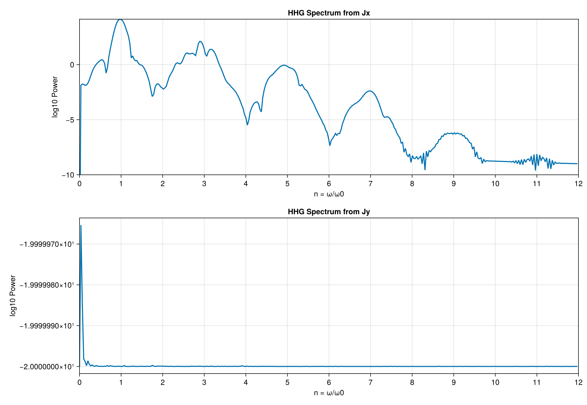

## 第2コマの流れ

::: {.columns}
::: {.column width="54%"}
### ここまでに作ったもの

- `examples/out/01_bands.png`
- `examples/out/02_timeevol_current.png`

### ここまでで分かっていること

- `H(k)` と `dH/dk` はコードで書ける
- `A(t)` を入れて GKSL方程式を濃くと `J(t)` が出る
- $\Delta=0$では `Jx` と `Jy` の振る舞いに差がある
:::

::: {.column width="46%"}
### 第2コマの出力

- `examples/out/03_hhg_fft.png`
- `examples/out/04_selection_rule.png`

### 流れ

- `J(t)` の再確認と動的対称性
- ハンズオン3
- FB3
- ハンズオン4
- FB4
- 余裕があれば CI / README / 公開の話
:::
:::

## `J(t)` をもう一度見る: 動的対称性の入口

::: {.columns}
::: {.column width="58%"}
{fig-alt="current in time domain" width=100%}

::: {.source-caption}
図: `examples/02_timeevol_current.jl`
:::
:::

::: {.column width="42%"}

### いま見ること

- `Jx` がどのような周波数成分を含んでいるか
- フーリエ変換によって周波数空間に移ると、どんな構造が見えるか
:::
:::

## ハンズオン3: FFT で HHG スペクトルを出す

::: {.columns}
::: {.column width="55%"}
### 必須で編集

- `src/fft.jl`

### 読むだけ

- `examples/03_hhg_fft.jl`

### 到達目標

- `hhg_spectrum` を埋めて `n = ω/ω0` 軸のスペクトルを作る
- `examples/03_hhg_fft.jl` で返ってきたスペクトルを描いて保存する
- `examples/out/03_hhg_fft.png` を保存する

:::

::: {.column width="45%"}
{fig-alt="hhg spectrum from fft" width=100%}

::: {.source-caption}
図: `examples/03_hhg_fft.jl`
:::

### 詰まったら

- `checkpoint-4-fft`
:::
:::

## ハンズオン3 詳細: `hhg_spectrum`

::: {.columns}
::: {.column width="50%"}
```julia
function hhg_spectrum(Jt, dt, ω0)
    # ここを実装
end
```
:::

::: {.column width="50%"}
### ここですること

- `Jt`から平均値を引いて 0 次成分を落とす
- `FFTW.jl`の`rfft`関数で正の周波数成分だけフーリエ変換する
- `dt` とサンプル数から周波数軸を作る
- `ω0` で割って横軸を次数 `n` に変換する
- `power=amplitude^2` をプロット用の強度として使う
- `(ω, n, power)` を返す

### 注意

- 軸の細かさは入力長 `N` と `dt` で決まる
:::
:::
## AI活用 Prompt: ハンズオン3 の前確認

::: {.prompt-card}
<div class="eyebrow">GitHub Copilot Agent</div>
利用文脈: `src/fft.jl` の `hhg_spectrum` を埋める前に、周波数軸の意味と確認項目を整理する。`examples/03_hhg_fft.jl` は入出力確認用に読むだけの前提とする。

```text
src/fft.jl の hhg_spectrum を埋める前に確認したいです。
現行実装では、simulate_currents が返す全時間領域をそのまま FFT に渡し、
前処理は平均値除去だけです。
この仕様で、
1. hhg_spectrum が何をどの順で計算しているか
2. dt とサンプル数が周波数軸にどう効くか
3. 実装後に examples/03_hhg_fft.jl で確認する項目
を整理してください。
```

:::

## FB3: HHGスペクトル

::: {.columns}
::: {.column width="55%"}
{fig-alt="hhg spectrum from fft" fig-align="center" width=80%}

::: {.source-caption}
`examples/03_hhg_fft.jl`
:::
:::

::: {.column width="45%"}

### ここで見ること

- `Jx` のピークが `n=整数` で見える
- 奇数次と偶数次の出方の違いが見える
- `Jy` がほぼ 0 なら、周波数空間でもほぼゼロ

### 問い
- 何が `Jx,Jy`のスペクトルの形状を支配しているのか？
:::
:::


## 動的対称性と選択則: 一般論

::: {.columns}
::: {.column width="50%"}
### 定義

$$
U^\dagger H(t + \Delta t) U = H(t)
$$

$$
U^\dagger \hat O(t + \Delta t) U = R \hat O(t)
$$

- 空間操作 $U$ と時間並進 $\Delta t$ を組にした対称性
- ここではレーザー周期を $T = 2\pi/\omega_0$ とし、論文の $\Omega$ を $\omega_0$ と読む
:::

::: {.column width="50%"}
### HHG への言い換え

- 半周期ずらしたときに電流が符号反転するなら、

$$
U^\dagger \hat J_\alpha(t + T/2) U = -\hat J_\alpha(t)
$$

- フーリエ成分は偶数次で打ち消し合う

$$
J_\alpha(2n\omega_0) = 0
$$

- つまり禁制になる次数を対称性だけで読める
:::
:::

## x方向直線偏光 + $\Delta=0$: 導出概要

::: {.columns}
::: {.column width="50%"}
### 1. 反転 + 半周期

$$
k' = (-k_x, k_y)
$$

$$
U_{\sigma yz} H_k(t + T/2) U_{\sigma yz}^\dagger = H_{k'}(t)
$$

- $U_{\sigma yz} \hat J_k(t + T/2) U_{\sigma yz}^\dagger$ の下で、$J_x$ は符号反転し、$J_y$ は不変
:::

::: {.column width="50%"}
### 2. 密度行列とフーリエへ写す

- $U_{\sigma yz} L_k U_{\sigma yz}^\dagger = L_{k'}$ なので、$U_{\sigma yz} \rho_k(t + T/2) U_{\sigma yz}^\dagger = \rho_{k'}(t)$
- ペア電流 $\tilde J_{\alpha,k}(t) := J_{\alpha,k}(t) + J_{\alpha,k'}(t)$ を作ると、$\tilde J_{x,k}$ は半周期で符号反転し、$\tilde J_{y,k}$ は不変
- 結果: $\tilde J_{x,k}(2m\omega_0)=0$, $\tilde J_{y,k}((2m+1)\omega_0)=0$
:::
:::

## 動的対称性と選択則まとめ

::: {.columns}
::: {.column width="50%"}
### $\Delta = 0$

- 残る対称性: $(U_{\sigma yz}, t + T/2)$, $(U_{\sigma zx}, t)$

$$
J_x(2n\omega_0)=0,\qquad J_y(t)=0
$$

- 観測: $J_x$ は奇数次中心、$J_y$ はほぼ 0
:::

::: {.column width="50%"}
### $\Delta \neq 0$

- 残る対称性: $(U_{\sigma yz}, t + T/2)$ のみ

$$
J_x(2n\omega_0)=0,\qquad J_y((2n+1)\omega_0)=0
$$

- 観測: $J_y$ の偶数次が立ち上がる
:::
:::

::: {.note}
連続波で厳密に成り立つ議論だが、今回の有限パルスでも定性的にはこの選択則で図を読める。
:::
